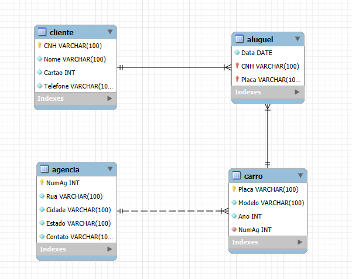

# 📦 Projeto de Banco de Dados - Locadora de Carros

## 📑 Descrição do Projeto

Este projeto tem como objetivo a criação de um banco de dados relacional para gerenciar uma locadora de veículos. Nele, desenvolvi toda a modelagem das entidades, seus atributos e os relacionamentos necessários para representar o funcionamento básico de uma empresa de aluguel de carros.

O sistema é composto por quatro tabelas principais:

- **Cliente:** Armazena os dados dos clientes, como CNH, nome, cartão e telefone.
- **Agência:** Contém informações das agências de aluguel.
- **Carro:** Registra os veículos disponíveis, vinculando-os à agência onde estão alocados.
- **Aluguel:** Controla os registros de locações feitas pelos clientes.

## 🛠️ Tecnologias Utilizadas

- **SGBD:** MySQL
- **Ferramenta de Modelagem:** MySQL Workbench
- **Linguagem SQL:** Criação de tabelas, constraints e inserção de dados.

## 🗺️ Modelo Relacional

<p align="center">
  
</p>

## 🧠 Criação das Tabelas

```SQL
-- Criando a tabela de Cliente
CREATE TABLE Cliente(
    CNH VARCHAR(100) NOT NULL,
    Nome VARCHAR(100) NOT NULL,
    Cartao INT NOT NULL,
    Telefone VARCHAR(100) NOT NULL,
    PRIMARY KEY(CNH)
);

-- Criando a tabela de Agência
CREATE TABLE Agencia(
    NumAg INT NOT NULL,
    Rua VARCHAR(100) NOT NULL,
    Cidade VARCHAR(100) NOT NULL,
    Estado VARCHAR(100) NOT NULL,
    Contato VARCHAR(100) NOT NULL,
    PRIMARY KEY(NumAg)
);

-- Criando a tabela de Carro
CREATE TABLE Carro(
    Placa VARCHAR(100) NOT NULL,
    Modelo VARCHAR(100) NOT NULL,
    Ano INT NOT NULL,
    NumAg INT NOT NULL,
    PRIMARY KEY(Placa),
    FOREIGN KEY(NumAg) REFERENCES Agencia(NumAg)
);

-- Criando a tabela de Aluguel
CREATE TABLE Aluguel(
    Data DATE NOT NULL,
    CNH VARCHAR(100) NOT NULL,
    Placa VARCHAR(100) NOT NULL,
    PRIMARY KEY (CNH, Placa),
    FOREIGN KEY(CNH) REFERENCES Cliente(CNH),
    FOREIGN KEY(Placa) REFERENCES Carro(Placa)
);
```
## 🚀 Habilidades Desenvolvidas

Durante o desenvolvimento deste projeto, desenvolvi e aprimorei diversas habilidades, incluindo:

- Criação de modelos conceituais e lógicos de banco de dados.
- Implementação de modelos relacionais utilizando SQL.
- Definição de chaves primárias e estrangeiras para garantir a integridade referencial.
- Resolução de erros relacionados a constraints e relacionamentos entre tabelas.

## 📚 Conclusão

Este projeto representa uma simulação completa de um sistema de banco de dados para uma locadora de veículos, desenvolvendo desde a modelagem até a criação das tabelas e seus relacionamentos. Além da construção do modelo relacional, realizei a geração dos dados de forma automatizada com apoio de inteligência artificial, o que me permitiu testar o banco com cenários realistas e validar sua integridade. Todos os dados utilizados são **fictícios e gerados por IA**, sem qualquer vínculo com informações reais.

